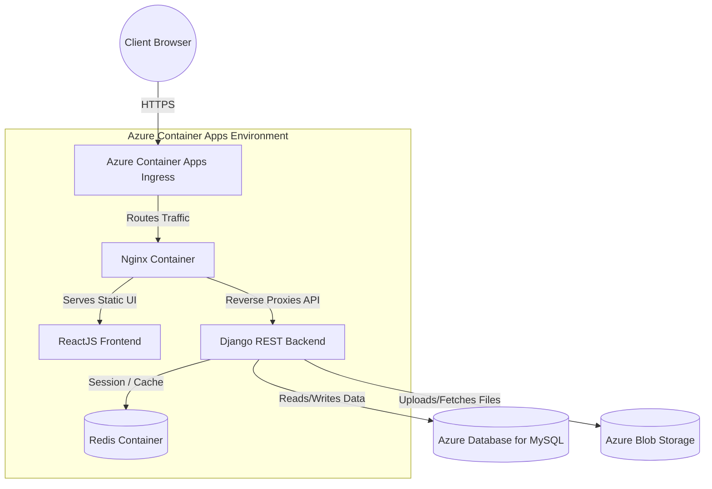

<div align="center">
  <p>
    
    
  </p>
  BSU Engineering Portal</h1>
  <h3>A comprehensive, role-based Faculty ERP and Website serving students, faculty, and administrative staff.</h3>
  <p>
    
    
    
    
    
    
  </p>
</div>

<br/>

## 1. Project Overview and Purpose

The **BSU Engineering Portal** is a unified, highly robust Faculty Website meticulously designed to serve the complete operational lifecycle of an engineering faculty. By centralizing information, modernizing administrative workflows, and providing specialized dashboards for every user type, the system eliminates traditional bureaucratic bottlenecks. 

It provides immense value by acting as a single source of truth for:
- **Students:** Accessing course materials, tracking attendance, submitting assignments, taking online quizzes, checking final grades, and applying to jobs.
- **Doctors / Faculty:** Managing course syllabi, uploading study materials, creating rigorous online assessments, and seamlessly grading student performance.
- **Heads of Department (HOD):** Assigning doctors to specific courses within their departments.
- **Deans:** Analyzing academic performance metrics and publishing final exam results.
- **Administrative Staff (Student and Staff Affairs):** Managing the master academic structure, bulk-uploading records, configuring grading templates, and managing tuition statuses.
- **Graduate Affairs:** Handling graduation clearance, issuing official certificates, and managing the alumni career portal (job postings and training events).
- **System Administrators:** Overseeing the entire technical operation, auditing system logs, and handling user security.

### Role-Based Feature Matrix
To guarantee security and data integrity, the system implements strict Role-Based Access Control (RBAC):

| Feature / Capability | Student | Doctor | HOD | Dean | Student Affairs | Staff Affairs | Graduate Affairs | Admin |
| :--- | :---: | :---: | :---: | :---: | :---: | :---: | :---: | :---: |
| **Take Quizzes and View Grades** | ✅ | ❌ | ❌ | ❌ | ❌ | ❌ | ❌ | ❌ |
| **Upload Materials and Grade Exams** | ❌ | ✅ | ❌ | ❌ | ❌ | ❌ | ❌ | ❌ |
| **Publish Final Results** | ❌ | ❌ | ❌ | ✅ | ❌ | ❌ | ❌ | ❌ |
| **Assign Doctors to Courses** | ❌ | ❌ | ✅ | ❌ | ❌ | ❌ | ❌ | ❌ |
| **Configure Grading Templates** | ❌ | ❌ | ❌ | ❌ | ❌ | ✅ | ❌ | ❌ |
| **Graduation Clearance and Career Portal**| ❌ | ❌ | ❌ | ❌ | ❌ | ❌ | ✅ | ❌ |
| **Issue Official Certificates** | ❌ | ❌ | ❌ | ❌ | ❌ | ❌ | ✅ | ❌ |
| **System Auditing and Security** | ❌ | ❌ | ❌ | ❌ | ❌ | ❌ | ❌ | ✅ |

---

## 2. System Architecture

The application relies on a modern, decoupled, containerized architecture hosted entirely within the Microsoft Azure ecosystem to guarantee high availability and scale.

**Data Flow Execution:**
1. **Client Request:** A user browses to `bsu-engineering.app`.
2. **Ingress:** The request hits the Azure Container Apps (ACA) Ingress controller, which securely handles SSL termination and custom domain routing.
3. **Reverse Proxy:** The request is passed to an **Nginx** container. Nginx acts as a high-performance web server, rapidly serving compiled static React assets and efficiently routing API requests.
4. **Application Tier:** 
   - API requests are forwarded from Nginx to the **Django REST Framework** backend via WSGI/ASGI.
   - The Django backend handles business logic, executing queries, and validating RBAC permissions.
5. **State and Storage Tier:** 
   - **Redis** (hosted within the ACA environment) is utilized for high-speed caching and rapid session management.
   - **Azure Database for MySQL** acts as the primary relational data store.
   - **Azure Blob Storage** seamlessly handles all uploaded media (course materials, profile pictures, certificates).

### High-Level Architecture Diagram


---

## 3. Technical Stack and Architecture Decision Records (ADRs)

Every technology in this stack was deliberately chosen to balance performance, developer experience, and long-term maintainability.

- **Domain and DNS (`bsu-engineering.app`):** Registered via Name.com for a 1-year term. DNS records point directly to the Azure Container Apps environment to ensure a seamless, professional entry point for all users.
- **Frontend (ReactJS):** Chosen for its component-based architecture. React allows for the creation of a highly dynamic, Single Page Application (SPA) feel, essential for complex dashboards where state changes frequently without requiring page reloads.
- **Web Server / Reverse Proxy (Nginx):** Justified by its unmatched efficiency in serving static assets. Placing Nginx in front of the application server bolsters security (hiding backend details) and improves performance by efficiently managing client connections and routing API traffic.
- **Backend (Django):** Selected for its rapid development cycle, incredibly robust built-in admin panel, and "batteries-included" security features (CSRF protection, SQL injection prevention). This makes it ideal for an educational portal handling sensitive academic data.
- **Database (Azure Database for MySQL):** MySQL provides the strong relational data integrity required for mapping complex faculty structures (Years -> Departments -> Courses -> Students). Utilizing a fully managed Azure service heavily reduces database maintenance and backup overhead.
- **Storage (Azure Blob Storage for Media):** Decoupling media storage from the application server ensures the backend remains stateless. This allows the application containers to scale horizontally without worrying about local file synchronization, significantly improving performance for heavy PDF/Video downloads.
- **Containerization (Docker and Docker Bake):** Docker ensures absolute consistency between local development and production. `Docker Bake` is utilized to efficiently manage, target, and build multiple complex image targets (Frontend, Backend, Nginx) concurrently from a single declarative configuration.
- **Hosting (Azure Container Apps - ACA):** ACA was selected for serverless container execution. It abstracts away the massive complexity of raw Kubernetes while still offering automated horizontal scaling based on HTTP traffic, built-in ingress, and simplified VNET networking.

---

## 4. Infrastructure and Deployment Strategy

**CRITICAL NOTE ON WORKFLOW:** Because this is a highly stable faculty website where feature updates are infrequent and deliberate, a fully automated CI/CD pipeline was intentionally omitted. This architectural decision heavily reduces operational overhead, prevents accidental deployments of academic systems during active exam periods, and simplifies the repository.

### Exact Deployment Steps

When a new version is ready for production, the deployment is executed via a tightly controlled manual workflow:

1. **Build the Containers:** 
   Locally build all necessary images using Docker Bake to ensure configuration parity.
   ```bash
   docker buildx bake -f docker-bake.hcl
   ```
2. **Push to Registry:** 
   Push the freshly built, tagged images to the Azure Container Registry (ACR).
   ```bash
   docker push <your-registry-name>.azurecr.io/bsu-backend:v1.x.x
   docker push <your-registry-name>.azurecr.io/bsu-nginx:v1.x.x
   ```
3. **Deploy via ACA Update:** 
   Log into the Azure Portal (or use the Azure CLI) and manually update the image tags within the Azure Container Apps environment. The ACA environment will automatically handle a zero-downtime rolling update.

*Note: Custom domain binding (`bsu-engineering.app`) and automatic SSL certificate generation/renewal are entirely managed at the Azure Container Apps ingress level, requiring zero manual certificate configuration.*

---

## 5. Prerequisites and Local Setup

To run this project locally for development or testing, ensure your machine meets the following prerequisites.

### Dependencies
- **Node.js** (v18+) and **npm**
- **Python** (v3.10+)
- **Docker** and **Docker Compose**
- **Git**

### Step-by-Step Local Initialization

**1. Clone the repository:**
```bash
git clone https://github.com/your-org/BSU_Engineering_Portal_Graduation_Project.git
cd BSU_Engineering_Portal_Graduation_Project
```

**2. Setup the Frontend:**
```bash
cd frontend
npm install
# To run locally outside of docker: npm run dev
cd ..
```

**3. Setup the Backend and Database Migrations:**
```bash
cd backend
python -m venv venv
source venv/bin/activate  # On Windows use: venv\Scripts\activate
pip install -r requirements.txt
python manage.py makemigrations
python manage.py migrate
# To run locally outside of docker: python manage.py runserver
cd ..
```

**4. "One-Click" Docker Compose (Recommended Development Flow):**
To spin up the entire application stack (Frontend, Backend, Redis, and Nginx proxy) exactly as it mimics production:
```bash
# First, ensure your .env files are configured (see section 6)
docker-compose up -d --build
```
Once the containers are running, the application will be accessible at `http://localhost`.

---

## 6. Environment Configuration

The application heavily relies on environment variables for security and environment-specific behaviors. You must create `.env` files based on the templates below. **Never commit actual secrets to version control.**

### Backend `.env` Template
Create a `.env` file in the `/backend` directory:
```env
# Core Django
DJANGO_SECRET_KEY=your_super_secret_key_here
DEBUG=True # Set to False in production
ALLOWED_HOSTS=localhost,127.0.0.1,bsu-engineering.app

# Database (Azure MySQL or Local)
DB_ENGINE=django.db.backends.mysql
DB_NAME=bsu_portal_db
DB_USER=your_db_user
DB_PASSWORD=your_db_password
DB_HOST=your-azure-mysql-server.mysql.database.azure.com
DB_PORT=3306

# Redis Cache
REDIS_URL=redis://redis:6379/1

# Azure Blob Storage
AZURE_ACCOUNT_NAME=your_storage_account_name
AZURE_ACCOUNT_KEY=your_storage_account_key
AZURE_CONTAINER=media-container
```

### Frontend `.env` Template
Create a `.env.development` and `.env.production` file in the `/frontend` directory:
```env
# API URL Routing
VITE_API_BASE_URL=http://localhost:8000/api  # Use the ACA domain in production
VITE_APP_ENV=development
```
